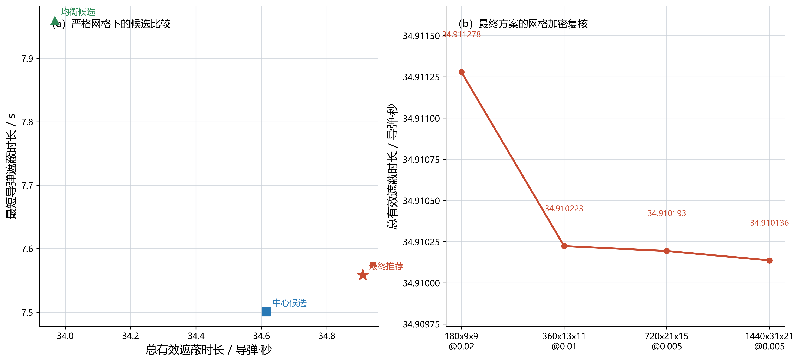
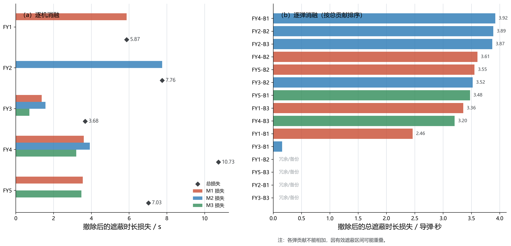
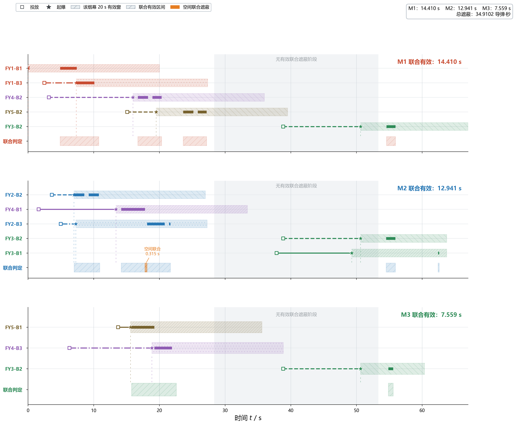

# 第五问：多无人机、多导弹烟幕协同防护的建模叙事与当前结果

> 适用对象：论文手、建模手与代码手。
>
> 本文给出第五问从第四问自然承接到最终推荐策略的完整叙事。严格复核、逐弹/逐机消融、遮蔽机制分解和 M3 可达性实验均已完成；所有数值均来自 `Q5/supplement/` 下的可复核 CSV。

---

## 一、问题定位：从单导弹协同到多导弹系统防护

问题三、四已经解决了“多枚烟幕如何共同遮蔽一枚来袭导弹视线”的问题；问题五进一步把场景扩展为：5 架无人机、每机 3 枚烟幕弹，需要同时应对 3 枚来袭导弹 M1、M2、M3。

第五问的关键变化并不只是烟幕数量从 3 枚变成 15 枚，而是出现了**资源竞争**：

- 同一架无人机的 3 枚烟幕弹共用一个航向与一个飞行速度；
- 一枚烟幕在同一时刻可能对不同导弹的视线都有影响，不能在建模前把它硬指定给某一枚导弹；
- 若把全部变量一次放进优化器，连续决策维数很高，且联合遮蔽判据本身又是非光滑的。

因此，本问要回答的是：在全部题设物理约束下，如何配置 5 架无人机的共同飞行参数及各自三枚烟幕的投放—起爆时序，使三枚导弹的**联合有效遮蔽总时长**尽可能大。

设三枚导弹的有效遮蔽时长分别为 \(T_{M1},T_{M2},T_{M3}\)，主目标为

\[
\max T_{\mathrm{sum}}=T_{M1}+T_{M2}+T_{M3}.
\]

这里的单位为“导弹·秒”：若某时刻 M1 和 M2 同时被有效遮蔽，则该时刻对总目标贡献 2 个导弹·秒。这一口径直接对应“同时保护多条威胁通道”的系统效能。

---

## 写作使用说明：哪些必须讲透，哪些只需交代

这份交接稿不是要求把全部代码细节写进论文。建议按下表控制篇幅，避免第五问既显得“黑箱”，又因实现细节过多而失去主线。

| 层次 | 论文中应写到的程度 | 原因 |
|---|---|---|
| **必须详细说明** | 联合完整遮蔽判据 (G_k(t))、总目标 (T_{\rm sum})、共同航向/速度约束；为什么不能直接做 40 维 DE；策略列—0-1 主问题—连续精修的分层逻辑；候选为何不只保留一个；完整圆柱逐级复核与最终数值稳定性 | 这些决定模型是否正确、为何可算，以及最终结论是否可信，是本问的核心贡献 |
| **需要解释但可压缩** | 初始策略列的来源、LP 松弛如何指出“尚未覆盖的高价值缺口”、保守/中心/乐观三种粗网格口径、词典序均衡的作用 | 每项用一段通俗说明即可，目的是让读者理解算法不是随意拼凑 |
| **一两句带过** | LHS 的具体样本数、DE 的交叉变异参数、softmax/间隔参数化、时间分批和数组分块的代码实现 | 它们是可复现的工程细节，可放附录或代码说明，正文不宜喧宾夺主 |

全文应始终保持一条主线：

\[
\text{联合遮蔽定义}
\rightarrow
\text{40 维直接搜索困难}
\rightarrow
\text{策略列降维}
\rightarrow
\text{0-1 组合选择}
\rightarrow
\text{多候选连续精修}
\rightarrow
\text{完整表面复核}
\rightarrow
\text{结果机制解释}.
\]

---

## 二、联合遮蔽判据：一枚烟幕不必预先属于某一枚导弹

对导弹 \(M_k\) 在时刻 \(t\) 的位置记为 \(M_k(t)\)，真目标圆柱外表面记为 \(\partial\Omega\)，表面点为 \(Q\)。对第 \(i\) 架无人机的第 \(r\) 枚烟幕，若它在时刻 \(t\) 处于有效窗口内，其球心记为 \(C_{ir}(t)\)。

从导弹到目标点 \(Q\) 的有限视线段为 \(\overline{M_k(t)Q}\)。烟幕对该点的遮挡距离定义为

\[
d_{kir}(t;Q)=d\bigl(C_{ir}(t),\overline{M_k(t)Q}\bigr).
\]

令 \(\mathcal A(t)\) 为当前有效的烟幕集合。对每一个目标表面点，允许从所有有效烟幕中选择最合适的一枚，因此联合遮蔽判据为

\[
G_k(t)=\max_{Q\in\partial\Omega}\ \min_{(i,r)\in\mathcal A(t)}d_{kir}(t;Q)\le R,
\qquad R=10\text{ m}.
\]

通俗地说：

1. 对圆柱表面的每个点，先看 15 枚烟幕中哪一枚最能挡住该点的视线；
2. 再找圆柱上最难挡住的那个点；
3. 若连这个最难点也被挡住，则该导弹在该时刻被完整遮蔽。

这一定义包含两种机制：

- **单烟幕完整遮蔽**：某一枚烟幕独自挡住整个圆柱；多枚烟幕依次发挥作用时，形成时间接力；
- **空间联合遮蔽**：没有任何单枚烟幕能独自挡住圆柱，但不同烟幕分别挡住不同表面点，合起来完成完整遮蔽。

第五问的正式评价器始终使用上述联合判据，而不把烟幕预先分配给某一导弹。

---

## 三、运动、变量与约束

### 3.1 物理运动模型

第 \(i\) 架无人机的初始位置为 \(F_{i0}\)，共享航向和速度分别为 \(\theta_i,v_i\)。它以匀速直线飞行：

\[
F_i(t)=F_{i0}+v_i t(\cos\theta_i,\sin\theta_i,0).
\]

第 \(r\) 枚烟幕在 \(t_{ir}\) 时刻投放、延迟 \(\tau_{ir}\) 后起爆，故起爆时刻为

\[
t_{eir}=t_{ir}+\tau_{ir}.
\]

起爆前按平抛运动处理；起爆后烟幕视为半径 10 m 的球，并以 \(3\text{ m/s}\) 匀速下沉，持续有效 20 s。导弹按题设初始位置与恒定速度直线飞行。

### 3.2 决策变量

物理决策可写为

\[
x_i=(\theta_i,v_i,t_{i1},t_{i2},t_{i3},\tau_{i1},\tau_{i2},\tau_{i3}),
\quad i=1,\ldots,5.
\]

共有 5 组无人机策略。代码内部以可行参数化方式生成投放间隔，避免随机生成大量不满足约束的方案。

### 3.3 约束条件

对每架无人机，严格满足：

\[
70\le v_i\le140,
\qquad \theta_i\in[0,2\pi),
\]

\[
t_{i,r+1}-t_{ir}\ge1\text{ s},\qquad \tau_{ir}\ge0,
\]

\[
t_{eir}\le T_{\max,i},
\qquad z_{i0}-\frac12g\tau_{ir}^2\ge0.
\]

其中 \(T_{\max,i}\) 随无人机初始位置变化，不能把问题二中 FY1 的 \(13.94\) s 上界错误地套用到其余无人机。本文保持前几问的统一简化：只要求起爆点不低于地面，不额外加入“烟幕有效 20 s 内不得触地”的题外截断。

---

## 四、为什么不直接做 40 维差分进化

第五问有三种自然思路：

| 方法 | 优点 | 主要问题 | 结论 |
|---|---|---|---|
| 直接对全部变量做 40 维 DE | 最直接；不预设任务分工 | 一次评价要检查 3 枚导弹、15 团烟幕、完整圆柱表面；目标函数呈大量台阶与平台，计算成本过高 | 不作为主线，只可作很小范围核验 |
| 先把无人机和导弹固定配对，再分战区独立求解 | 速度快、叙事直观 | 会把“同一烟幕可能服务不同导弹”及混合协同结构人为排除，可能漏掉更优解 | 只作为启发式种子来源 |
| 策略列生成 + 0-1 主问题 + 连续精修 | 将高维连续搜索拆为可解释的“列库选择”和少量局部连续优化；可保留多导弹联合判据 | 实现较复杂，须做完整表面复核避免粗网格误判 | 正式采用 |

正式方法没有把物理问题粗暴地拆成互不相干的战区，而是只在搜索层面做分解：每架无人机先形成多套完整的“三弹策略列”，主问题从每架的列库中选一套组合；最终仍由三枚导弹的联合完整遮蔽判据统一复核。

---

## 五、逐层求解流程

### 5.1 先建立策略列库，而不是搜索 40 维大空间

一个**策略列**不是“一枚烟幕的选择”，而是**一架无人机完整的行动方案**：它同时包含共同航向、共同速度和 3 枚烟幕的投放—起爆时序。换言之，主问题最终不是从 15 枚互相独立的烟幕中逐枚挑选，而是从 FY1 至 FY5 各自的候选方案中各选一套。这正好保留了“同一架无人机三枚弹共用航向和速度”的题设耦合。

初始列库有三类来源，三者缺一不可：

1. **已验证的可行锚点**：包括前序高质量方案、删去冗余烟幕后仍可行的方案，以及单机/单弹候选库。它们保证列库从一开始就包含物理上合理的投放位置与起爆时序。
2. **少量结构化种子**：由单弹好方案扩展为“三弹梯次列”。例如先以某架无人机对某条视线通道效果较好的单弹方案为锚点，保留其航向、速度和大致引爆延迟，再将三枚弹布置在早、中、晚的相邻时段，并作整体前移、居中和后移扰动。这里“对 M2 有效的锚点”只用于生成候选，不意味着该列以后只能服务 M2；正式联合判据仍允许它同时影响三枚导弹。
3. **全域分层随机列**：在完整可行域加入 LHS 样本，防止策略列库只反映人工预设的接力形态，从而漏掉混合协同方案。

初始列库共有 107 列。随后执行 3 轮列生成，每轮对每架无人机至多加入 4 个新列，最终形成 167 列的候选库。正文不必罗列所有列，只需说明：**列库既含物理启发式，又保留全域随机探索；它是缩小搜索成本的手段，而不是预先固定任务分工。**

### 5.2 用圆柱面片覆盖构造 0-1 主问题

完整圆柱表面在主问题阶段被划为小面片；时间轴同时离散为时间单元。对每个“策略列—导弹—时间单元—面片”，预先记录该列能否参与遮挡该面片。这可以理解为：每一列都预先带着一张“覆盖地图”，地图告诉我们该无人机采用这一整套飞行与投放策略后，能在什么时刻遮住哪枚导弹视线下的哪些圆柱面片。

定义二元变量：

\[
x_{ij}=1 \Longleftrightarrow \text{第 }i\text{ 架无人机选第 }j\text{ 套策略列}.
\]

并要求每架无人机只能选一套：

\[
\sum_jx_{ij}=1,\qquad i=1,\ldots,5.
\]

当某个导弹—时间单元要计入有效时长时，圆柱的全部面片都必须被至少一个被选策略列覆盖。由此得到 0-1 整数规划主问题。它解决的是“5 架无人机的完整策略怎样搭配”，而非逐枚烟幕做粗糙分配。

为扩充列库，程序还会先求一次**LP 松弛主问题**：暂时把本应只能取 0 或 1 的“是否选此列”变量放宽为 \(0\sim1\) 的连续数。这个放宽解本身不是最终战术方案，它的价值在于给出每个“导弹—时刻—面片”覆盖约束的影子价格（对偶权重）。通俗地说，某个位置的权重越高，表示它在当前列库中越难补、补上后越有价值。

随后对每架无人机执行一个低维定价搜索，专门寻找能覆盖这些高权重缺口的新三弹策略列；新列若与已有列不同且确有增益，才加入列库。论文中建议保留这一段解释，因为它回答了“后续新列如何产生”；但无需写出 LP 的矩阵形式、对偶变量编号或软件调用细节。

### 5.3 粗网格的不确定性：保守、中心、乐观三种口径

小面片本身会带来离散误差，因此主问题同时给出三种覆盖口径：

- **保守面片**：要求整个面片都能被认证遮挡；
- **中心面片**：用面片中心代表该面片，是主搜索口径；
- **乐观面片**：只要面片可能被覆盖就计入。

标准搜索得到的采样结果为：

\[
T_{\mathrm{lower}}=27.0,\qquad
T_{\mathrm{center}}=35.6,\qquad
T_{\mathrm{upper}}=41.6\quad \text{导弹·秒}.
\]

这不是最终答案，而是告诉我们：粗网格下中心模型的估计处于保守—乐观范围之间，最终必须回到完整圆柱面进行严格复核。

### 5.4 用词典序均衡避免主问题阶段压缩最弱通道

若只最大化总遮蔽时长，粗网格可能把资源过度集中给容易防护的导弹。于是主问题额外做两阶段词典序均衡：

第一阶段求总时长最优值

\[
\widehat T_{\mathrm{sum}}^*=\max\sum_{k=1}^3\widehat T_{Mk};
\]

第二阶段允许总时长少于该值至多一个时间单元 \(\Delta t=0.2\) s，并最大化最短导弹时长 \(z\)：

\[
\max z,
\]

\[
\text{s.t.}\quad \sum_{k=1}^3\widehat T_{Mk}
\ge \widehat T_{\mathrm{sum}}^*-0.2,
\qquad z\le\widehat T_{Mk},\ k=1,2,3.
\]

本次均衡主问题的采样总时长为 35.4 导弹·秒，最短导弹时长为 8.4 s，满足近优总时长约束。注意：该均衡步骤用于**候选发现和防漏解**；最终正式排序仍遵守题目主目标“总遮蔽时长优先”。

### 5.5 不只精修一个候选：防止粗网格选择偏差

粗网格主问题无法保证唯一候选在完整圆柱上仍然最好。因此，先对 11 个主问题候选以 \(90\times7\times7@0.03\) 的完整圆柱评价器重排；然后保留“三枚导弹均为正、总时长距最佳候选不超过 1 s”的候选。

在这些候选中：

1. 强制保留 `master_balanced`；
2. 将各无人机的航向、速度、三次投放时刻和三次引爆延迟组成一个可比较的方案特征向量；
3. 用最远点贪心法选出参数结构差异最大的 4 个代表；
4. 对每个代表逐架无人机做局部 DE：其余四架固定，只优化当前无人机的共同航向、速度和三弹时序；只有总时长增加且三枚导弹均保持正遮蔽时才接受更新。

四个代表分别是 `master_balanced`、`master_center_rank3`、`master_center_rank7` 与 `master_lower`。这种做法的意义是：不把“中心面片主问题第一名”错误当作唯一正确结构，也不把人工分类写成死约束。

这里的“特征向量”只用于判断两个候选是否属于相似的策略结构，并不改变任何物理模型或目标函数。具体做法是：

- 航向以 \((\sin\theta_i,\cos\theta_i)\) 表示，而不是直接比较角度数值，避免 \(1^\circ\) 与 \(359^\circ\) 被误判为相距很远；
- 速度按其允许区间 \([70,140]\) 线性缩放到约 \([0,1]\)；
- 每枚弹的投放时刻除以全局时间尺度，引爆延迟除以该无人机允许的最大延迟；
- 按 FY1 至 FY5 的固定顺序将这些量拼接起来，得到一条描述“五机完整策略”的向量。

随后先选定必须保留的均衡候选，再反复加入“与已选候选最不相似、且完整表面成绩仍足够好”的方案，这就是最远点贪心法。它的作用不是聚类后人为限制搜索，而是让有限的 4 次连续精修尽量覆盖不同的空间布局与时间接力结构，从而降低粗网格误选单一结构的风险。该解释建议在正文保留一小段；上述归一化细节可压缩为一句或置于附录。

### 5.6 逐级完整圆柱复核

全部原候选和精修候选依次经历：

\[
180\times9\times9@0.02
\rightarrow
360\times13\times11@0.01
\rightarrow
720\times21\times15@0.005
\rightarrow
1440\times31\times21@0.005.
\]

其中前五名进入高密度复核，前三名进入严格复核，冠军再用更密网格独立交叉检查。高密度计算采用“时间分批 + 表面点分块 + 平方距离公式”，避免出现大数组内存峰值；这只改变计算顺序，不改变有限视线段—烟幕球的几何判据。

**【插图：候选选择与网格复核，放在本节末】**

左图只比较已经通过同一完整圆柱评价器重排的候选：横轴是总遮蔽时长，纵轴是三枚导弹中的最短遮蔽时长。它用于说明“均衡候选并非最终主目标下唯一冠军”，以及为什么不能仅精修粗网格排名第一的方案。红色五角星是最终推荐方案；读图时应强调它在总时长上胜出，而均衡候选在最短通道指标上更好。

右图将同一冠军放在 \(180\)、\(360\)、\(720\)、\(1440\) 四种表面密度下重算。它用于说明最终数值对网格加密稳定，而不是说明优化算法已经理论收敛。正文建议紧接图写一句：*“故以下结果均按 \(720\times21\times15@0.005\) 的正式复核口径报告，\(1440\times31\times21@0.005\) 仅作为独立加密校验。”*

---

## 六、当前已确认的结果与解释

### 6.1 候选比较

严格复核排名如下：

| 来源 | M1 / s | M2 / s | M3 / s | 总时长 / 导弹·秒 | 最短导弹时长 / s |
|---|---:|---:|---:|---:|---:|
| `refined_master_lower` | 14.4102 | 12.9413 | 7.5587 | **34.9102** | 7.5587 |
| `refined_master_center_rank3` | 14.8935 | 12.2210 | 7.5006 | 34.6151 | 7.5006 |
| `refined_master_balanced` | 13.8165 | 12.1926 | 7.9595 | 33.9686 | **7.9595** |

原先正式方案对应第三行，总时长为 33.9686 导弹·秒。新推荐方案 `refined_master_lower` 将总时长提高到 34.9102 导弹·秒，增加：

\[
34.9102-33.9686=0.9415\quad\text{导弹·秒},
\]

约提升 2.77%。

### 6.2 加密交叉验证

新冠军在更密的 \(1440\times31\times21@0.005\) 网格上得到：

\[
T_{\mathrm{sum}}=34.9101359\quad\text{导弹·秒}.
\]

与 720 网格的差为

\[
34.9101359-34.9101927=-0.0000568\text{ s},
\]

远小于 0.01 s。因此可表述为：在本题采用的高密度离散表面口径下，推荐方案对表面加密稳定；但不应写成“已证明连续圆柱表面的理论最优”。

### 6.3 如何解释“保守主问题候选反而成为最终冠军”

这不是矛盾。`master_lower` 在粗面片阶段采用了更严格的覆盖要求，因此其初始采样得分低；但它保留了一种与中心面片最优解不同的无人机空间布局。经连续精修后，FY1 和 FY2 的调整显著增强了 M1、M2 的遮蔽时间，使其真实完整圆柱总效能超过均衡候选。

这正好说明多候选精修的必要性：

\[
\text{粗网格候选库}
\neq
\text{最终完整表面排序}.
\]

若只精修中心模型第一名或均衡解，会错过当前的 34.9102 导弹·秒方案。

### 6.4 总时长提高为何伴随 M3 下降

与原正式方案相比，新方案中：

- M1 增加约 0.594 s；
- M2 增加约 0.749 s；
- M3 减少约 0.401 s。

这反映了主目标的真实取舍：题设主目标是三枚导弹有效遮蔽时间之和，因此最终推荐方案优先选择总时长更长者；而词典序均衡步骤则保证搜索初期不会只围绕 M1、M2 形成单一候选结构。

论文中应如实写为：

> 在总遮蔽效能优先的目标下，推荐方案通过增加 M1、M2 的遮蔽时长获得 0.9415 导弹·秒的系统收益；其代价是 M3 的遮蔽时长有所缩短。均衡候选可作为“最短通道表现更好”的对照方案，而非最终主目标下的推荐方案。

不要写成“新方案同时提高了总效能和均衡性”。

---

## 七、消融、机制分解与 M3 解释

### 7.1 逐弹消融

固定新冠军其余 14 枚烟幕，每次删除 1 枚，共 15 次，得到如下关键边际损失（单位：导弹·秒）：

\[
\Delta T_{M1},\ \Delta T_{M2},\ \Delta T_{M3},\ \Delta T_{\mathrm{sum}}.
\]

| 关键烟幕 | 删除后的总时长损失 | 主要影响通道 |
|---|---:|---|
| FY2-B2 | 3.8875 | M2 |
| FY2-B3 | 3.8687 | M2 |
| FY4-B1 | 3.9210 | M2 |
| FY4-B2 | 3.6066 | M1 |
| FY4-B3 | 3.2040 | M3 |
| FY5-B1 | 3.4755 | M3 |
| FY5-B2 | 3.5544 | M1 |
| FY3-B2 | 3.5221 | M1、M2、M3 |

FY1-B2、FY2-B1、FY3-B3、FY5-B3 的边际损失接近数值容差，说明在当前方案中它们存在冗余或被其他烟幕替代。边际贡献不应相加为总时长，因为多团烟幕的遮挡区间会重叠。

### 7.2 逐机消融

固定其余四架无人机，每次删除一架的全部三枚烟幕，共 5 次：

| 删除无人机 | 总时长损失 | 主要损失来源 |
|---|---:|---|
| FY4 | 10.7316 | 同时影响 M1、M2、M3，是系统关键节点 |
| FY2 | 7.7562 | 主要影响 M2 |
| FY5 | 7.0299 | 主要影响 M1、M3 |
| FY1 | 5.8732 | 主要影响 M1 |
| FY3 | 3.6802 | 对三条通道均有补充作用 |

因此，不能把防御任务简单划成“一机一弹”；FY4、FY5 与 FY3 都表现出跨通道贡献。

**【插图：逐机、逐弹消融贡献，放在 7.1—7.2 之后】**

左图的每一组柱表示“删去某一架无人机的全部 3 枚烟幕后”，M1、M2、M3 分别损失多少遮蔽时长；菱形点是总损失。它支撑“FY4 是跨通道关键节点、FY2 主要支撑 M2、FY5 同时支撑 M1 与 M3”这一解释。

右图每次只删去一枚烟幕，按总时长损失排序；柱体颜色标示主要受影响的导弹通道。近零柱应解释为当前方案中的冗余或备份，而不是程序失效。图注或正文务必加上：**消融贡献不能相加**，因为多枚烟幕的遮蔽区间可以重叠、也可能相互替代。该图负责“量化谁重要”，不负责证明空间联合遮蔽，后二者应分开叙述。

### 7.3 遮蔽机制分解

对每枚导弹的每一段联合有效时间，逐时刻判断：

1. 是否存在某一枚烟幕独自完整遮蔽圆柱；
2. 若不存在，但联合判据成立，则计为真正的空间联合遮蔽。

结果为：

| 导弹 | 单烟幕完整遮蔽接力 / s | 空间联合遮蔽 / s | 结论 |
|---|---:|---:|---|
| M1 | 14.4102 | 0 | 完全由时间接力形成 |
| M2 | 12.6263 | 0.3150 | 以接力为主，存在短暂空间联合遮蔽 |
| M3 | 7.5587 | 0 | 完全由时间接力形成 |

M2 的空间联合段为 \([17.8033,18.1183]\) s，占 M2 有效时长约 2.43%，占系统总时长约 0.90%。因此论文的准确结论是：**系统总收益主要来自多无人机、多烟幕的时间接力；M2 局部存在可测得但时长较短的空间联合协同。**

**【插图：三通道联合遮蔽机制时间轴，放在本节结论之后】**

图分为 M1、M2、M3 三个上下小面板，每个面板严格沿用问题三时间轴的视觉语法：每一行是一枚实际参与该导弹通道遮蔽的烟幕，空心方块表示投放、五角星表示起爆、方块至星形的实线/虚线/点画线表示该弹从投放到起爆的阶段；起爆后的浅色纹理矩形表示题设规定的 20 s 烟幕有效窗；其中较粗的同色短线才表示该烟幕独自完整遮蔽圆柱的实际承担时段。

每个面板最下方的“联合判定”行才是正式结果：其阴影区间由完整圆柱联合判据给出，而不是由单枚烟幕的有效窗直接相加。橙色交叉纹理段是 M2 的 \(0.315\) s 空间联合遮蔽，它没有被硬归给单枚烟幕；灰色带为三个通道均无联合遮蔽的阶段。该图应按如下顺序解读：先看三个“联合判定”行，得到 M1、M2、M3 的有效区间和时长；再向上看粗线的首尾衔接，说明多数收益来自时间接力；最后看唯一的橙色小段，说明空间联合存在但只占很小比例。不要把这张图表述成“所有烟幕都在同一时刻共同遮蔽”，它恰恰说明主要机制是顺序接力。

### 7.4 M3 较短的解释不应只归咎于 FY3

M3 的单机候选库最佳时长分别为 FY1：0、FY2：3.6370 s、FY3：1.3947 s、FY4：3.4711 s、FY5：3.7374 s。结合逐机消融，M3 较短并非只由 FY3 决定。

需要用下列三类证据共同解释：

1. FY1—FY5 单机对 M3 的最好可达时长；
2. 各机初始横向位置、初始高度和引信延迟上界；
3. 逐机/逐弹消融后 M3 的实际时长损失。

合理的论文逻辑是：负侧空域的几何条件、FY3 的低高度限制，以及其他无人机还要兼顾 M1/M2 的共享航向和烟幕资源，共同压缩了 M3 的可用遮蔽窗口。尤其 FY5 单机对 M3 的潜力最高，但其在最终方案中也承担 M1 的关键遮蔽任务；这体现了共享航向与有限烟幕资源带来的系统耦合。

---

## 八、论文推荐章节顺序

建议第五问按以下顺序写入正文：

1. **问题重述与难点**：由单导弹联合遮蔽推广到多导弹资源竞争；
2. **联合完整遮蔽模型**：给出 \(G_k(t)\) 和 \(T_{\mathrm{sum}}\)；
3. **变量、运动方程与约束**：强调共同航向、共同速度和时序约束；
4. **求解策略比较与选择**：说明不采用直接 40 维 DE，采用策略列—主问题—精修；
5. **策略列生成和 0-1 主问题**：写面片覆盖逻辑及三种粗网格口径；
6. **词典序均衡与多候选精修**：说明其防漏解作用，不把它误说成最终唯一目标；
7. **逐级完整表面复核**：给出网格加密链和分批计算说明；此处插入图 5-4 `q5_04_selection_and_grid_check.png`；
8. **结果表与解释**：给出三名严格候选、推荐方案与 1440 交叉验证；
9. **消融和机制分解**：先插图 5-3 `q5_03_ablation_contributions.png` 定量说明关键无人机/烟幕，再插图 5-1 `q5_01_three_channel_timeline.png` 解释时间接力与空间联合；
10. **局限性**：本结果是当前可行域、候选列库与高密度数值复核口径下的推荐方案，不宣称理论全局最优。

可压缩成一条主叙事线：

\[
\text{联合遮蔽定义}
\rightarrow
\text{高维直接搜索困难}
\rightarrow
\text{策略列降维}
\rightarrow
\text{0-1 主问题组合}
\rightarrow
\text{均衡候选防漏解}
\rightarrow
\text{多结构连续精修}
\rightarrow
\text{完整圆柱逐级复核}
\rightarrow
\text{推荐方案与取舍解释}.
\]

---

## 九、当前应避免的表述

- 不写“直接证明了全局最优”；应写“在当前策略列库、搜索范围和高密度复核判据下的推荐方案”。
- 不写“新方案更均衡”；数据表明它以 M3 时长下降换取了 M1、M2 增益和总效能提升。
- 不写“存在空间联合遮蔽”；除非后续机制分解确实得到非零且超过数值容差的空间联合时长。
- 不把保守/中心/乐观面片值直接当作最终结果；它们只用于粗搜索阶段刻画离散误差范围。
- 不将某架无人机固定解释为只负责某一枚导弹；最终联合判据允许烟幕同时服务不同导弹。
